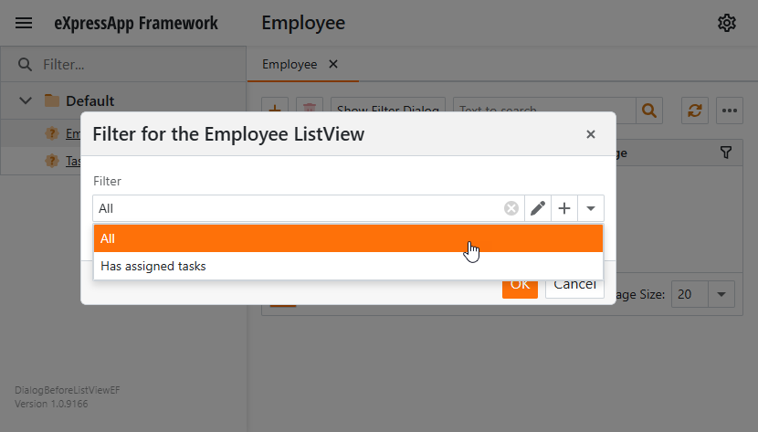

<!-- default badges list -->

<!-- default badges end -->

# XAF - How to show a filter dialog before a List View

This example displays a pop-up filter dialog that allows users to set a filter for a list view before the application starts to load list view data. Users can create filters and save them in a data source. This approach can be useful when the list view contains a large amount of data.

## Implementation Details

1. Extend the Application Model with an additional property.
    * Implement an interface that exposes the [AdditionalCriteria](CS/EFCore/DialogBeforeListViewEF/DialogBeforeListViewEF.Module/Module.cs#L40) property. This property stores the applied filter criteria.
    * Override the [ExtendModelInterfaces](https://docs.devexpress.com/eXpressAppFramework/DevExpress.ExpressApp.ModuleBase.ExtendModelInterfaces(DevExpress.ExpressApp.Model.ModelInterfaceExtenders)) method of your base Module to extend the Application Model with the declared interface and the `AdditionalCriteria` property.
2. Create the [ViewFilterObject](CS/EFCore/DialogBeforeListViewEF/DialogBeforeListViewEF.Module/BusinessObjects/ViewFilterObject.cs) class. Instances of this class store user filters.
3. Create the non-persistent [ViewFilterContainer](CS/EFCore/DialogBeforeListViewEF/DialogBeforeListViewEF.Module/BusinessObjects/ViewFilterContainer.cs) class. An object of this class contains a list of user filters (`ViewFilterObject` objects) and the currently applied filter. The `ViewFilterContainer`'s Detail View serves as the filter dialog.  
4. Implement [ShowFilterDialogController](CS/EFCore/DialogBeforeListViewEF/DialogBeforeListViewEF.Module/Controllers/ShowFilterDialogController.cs) to display the filter dialog. When a user selects a filter and clicks the **OK** button, the controller assigns the corresponding filter criteria to the `AdditionalCriteria` Application Model property.
5. Implement [NewViewFilterObjectController](CS/EFCore/DialogBeforeListViewEF/DialogBeforeListViewEF.Module/Controllers/NewViewFilterObjectController.cs) to initialize a new instance of the `ViewFilterObject` class when a user clicks **New** in the `ViewFilterObject` lookup List View.

## Files to Review

* [Module.cs](CS/EFCore/DialogBeforeListViewEF/DialogBeforeListViewEF.Module/Module.cs)
* [ViewFilterObject.cs](CS/EFCore/DialogBeforeListViewEF/DialogBeforeListViewEF.Module/BusinessObjects/ViewFilterObject.cs)
* [ViewFilterContainer.cs](CS/EFCore/DialogBeforeListViewEF/DialogBeforeListViewEF.Module/BusinessObjects/ViewFilterContainer.cs)
* [ShowFilterDialogController.cs](CS/EFCore/DialogBeforeListViewEF/DialogBeforeListViewEF.Module/Controllers/ShowFilterDialogController.cs)
* [NewViewFilterObjectController.cs](CS/EFCore/DialogBeforeListViewEF/DialogBeforeListViewEF.Module/Controllers/NewViewFilterObjectController.cs)

## Documentation

- [Non-Persistent Objects](https://docs.devexpress.com/eXpressAppFramework/116516/business-model-design-orm/non-persistent-objects)
- [Data Types of Business Class Properties and Built-in Property Editors](https://docs.devexpress.com/eXpressAppFramework/113014/business-model-design-orm/data-types-supported-by-built-in-editors)
- [How to: Extend and Access the Application Model Nodes from Controllers](https://docs.devexpress.com/eXpressAppFramework/112785/ui-construction/application-model-ui-settings-storage/customize-application-model-in-code/how-to-extend-the-application-model-nodes-from-controllers)
- [ShowNavigationItemController Class](https://docs.devexpress.com/eXpressAppFramework/DevExpress.ExpressApp.SystemModule.ShowNavigationItemController)
- [DialogController class](https://docs.devexpress.com/eXpressAppFramework/DevExpress.ExpressApp.SystemModule.DialogController)
- [Lookup List View](https://docs.devexpress.com/eXpressAppFramework/400501/ui-construction/controllers-and-actions/actions/access-actions-in-different-ui-areas/lookup-list-view).

## More Examples

- [How to Extend the Application Model](https://github.com/DevExpress-Examples/xaf-how-to-extend-the-application-model)

<!-- feedback -->
## Does this example address your development requirements/objectives?

 

(you will be redirected to DevExpress.com to submit your response)
<!-- feedback end -->
